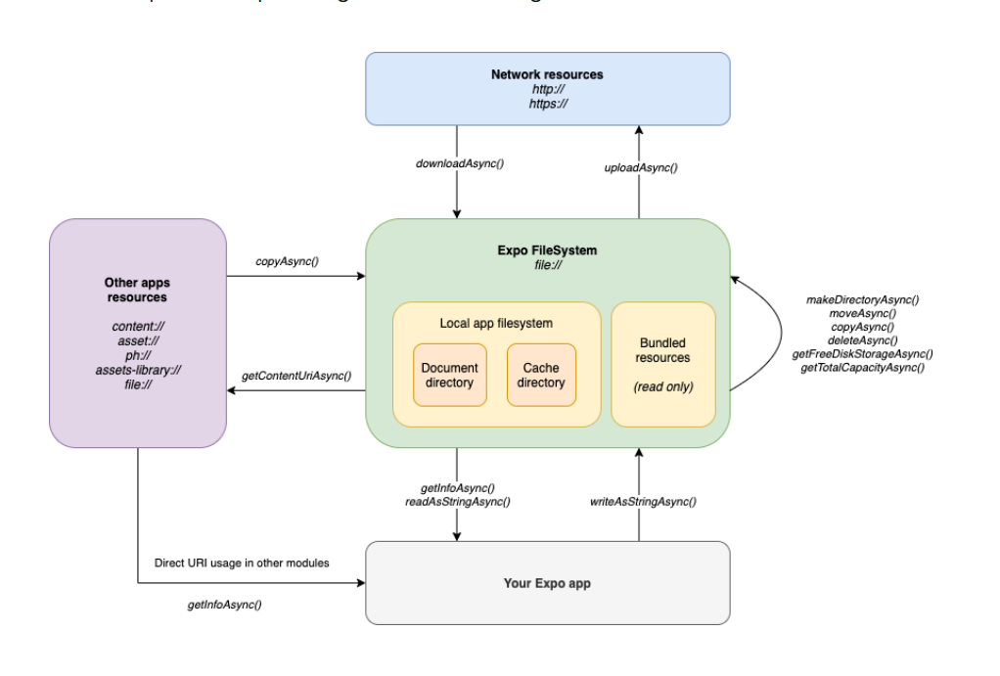

# What I learned

- [What I learned](#what-i-learned)
  - [Nested navigation and drawer navigation](#nested-navigation-and-drawer-navigation)
  - [Dynamic routing](#dynamic-routing)
  - [Travel App](#travel-app)
    - [Two column layout](#two-column-layout)
    - [Image Overlay](#image-overlay)
    - [Tabs](#tabs)
    - [Search bar](#search-bar)
    - [Cool curvy down thingy](#cool-curvy-down-thingy)
    - [Chat Message Component](#chat-message-component)
    - [Scrollview and shadow: general settings](#scrollview-and-shadow-general-settings)
  - [Weather app](#weather-app)
    - [Image blur](#image-blur)
    - [Search bar](#search-bar-1)
  - [ChatGPT app](#chatgpt-app)
    - [Expo AV](#expo-av)
      - [Creating sounds](#creating-sounds)
      - [Playing Sounds](#playing-sounds)
    - [Recording](#recording)
    - [Stopping recordings](#stopping-recordings)
  - [Components](#components)
    - [CSS Linear Gradient](#css-linear-gradient)
    - [Button](#button)
    - [Gradient Button](#gradient-button)
    - [Dark mode button](#dark-mode-button)
  - [React Native Animatable](#react-native-animatable)
    - [Animated Components](#animated-components)
    - [Props](#props)
    - [Animations](#animations)
    - [Transitions](#transitions)
    - [Imperative animations](#imperative-animations)
    - [Keyframes](#keyframes)
  - [Expo Filesystem](#expo-filesystem)
    - [Downloading files to expo filesystem](#downloading-files-to-expo-filesystem)
    - [mock API call](#mock-api-call)
    - [Sharing files](#sharing-files)
    - [Converting expo filesystem uris to raw data](#converting-expo-filesystem-uris-to-raw-data)
    - [Uploading to a server](#uploading-to-a-server)
    - [Getting file info](#getting-file-info)
  - [React native onboarding flow](#react-native-onboarding-flow)
    - [Control flow](#control-flow)
    - [Async storage class](#async-storage-class)
  - [React native lottie](#react-native-lottie)
    - [Lottie Props](#lottie-props)
    - [Imperative lottie use](#imperative-lottie-use)
  - [Moti](#moti)
    - [Installation](#installation)
    - [Basic Use](#basic-use)
    - [Animate Presence](#animate-presence)
    - [Skeleton component](#skeleton-component)
  - [React Native Elements](#react-native-elements)
    - [Installation](#installation-1)
    - [Theme](#theme)
      - [useTheme()](#usetheme)
      - [useThemeMode()](#usethememode)
      - [React Navigation and react native elements theming](#react-navigation-and-react-native-elements-theming)
    - [Container Style](#container-style)
    - [HOC components](#hoc-components)
    - [Components](#components-1)
      - [AirBNBRating](#airbnbrating)
      - [Avatar](#avatar)
      - [Badge](#badge)
      - [BottomSheet](#bottomsheet)
      - [Button](#button-1)
      - [Checkbox](#checkbox)
      - [Chip](#chip)
      - [Divider](#divider)
      - [FAB](#fab)
      - [LinearProgress](#linearprogress)
      - [ListItem Accordion](#listitem-accordion)
      - [Overlay](#overlay)
      - [Pricing card](#pricing-card)
      - [Search Bar](#search-bar-2)
      - [Slider](#slider)
      - [Skeleton](#skeleton)
      - [Social Icon](#social-icon)
      - [Speed Dial](#speed-dial)
      - [Switch](#switch)
      - [Tabs](#tabs-1)
      - [Tooltip](#tooltip)
  - [Expo SQLite](#expo-sqlite)
    - [Installation](#installation-2)
    - [Architecture](#architecture)

## Nested navigation and drawer navigation

1.  The Root layout must always render a `<Slot>` component. Dont' have any routing stacks in the root layout.

    ```javascript
    function RootLayoutNav() {
      return (
        <ThemeProvider>
          <Slot />
        </ThemeProvider>
      );
    }
    ```

2.  Create a route gorup for any nested navigation. For example, for the drawer navigation, just set up drawer navigation in the layout of the `(drawer)` route group

    ```javascript
    import React from "react";
    import Drawer from "expo-router/drawer";

    export default function _layout() {
      return (
        <Drawer
          screenOptions={{
            headerShown: false,
          }}
        >
          <Drawer.Screen name="travel-app" />
        </Drawer>
      );
    }
    ```

3.  For the `index.tsx` that the app will always defualt route to, set up a redirect when the navigation state is ready.

```javascript
import React from "react";
import { Redirect } from "expo-router";
import { useRootNavigation } from "expo-router";
import { LoadingScreen } from "../components/StyleComponents";

export default function index() {
  const navigation = useRootNavigation();
  const [ready, setReady] = React.useState(false);

  // useEffect to get ready state for navigation
  React.useEffect(() => {
    if (!navigation?.isReady) return;

    setReady(true);
  }, [navigation?.isReady]);

  // when ready, just redirect
  if (ready) return <Redirect href="/travel-app" />;

  return <LoadingScreen />;
}
```

Here is how we can think of it:

- **Root layout**, `_layout.tsx` : renders the `<Slot />`
- **Root route**, `index.tsx` : waits for navigation and renders `<Redirect />`
- **Route group and drawer navigation**, `(drawer)/_layout.tsx` : renders the `<Drawer />`
- **Drawer pages** : You can have an `index.tsx` for a standard home drawer route, but you can also create folders with stack navigator layouts for more complex pages.

## Dynamic routing

You can use query parameters just like how you would in the web to navigate to pages and pass data through to them.

1. Navigate to a route, and the at the end of a route string, tack on query parameters with `?`

```javascript
router.push(
  `/travel-app/destinations?title=${destination.title}&description=${destination.longDescription}`
);
```

2. ON the route you're navigating to, grab all the search params with `useLocalSearchParams()

```javascript
// get params from url
const params = useLocalSearchParams<{
  description: string;
  title: string;
}>();

// make a call to mock database, finding data with associated id
const findDestinationBasedOnTitle = (title: string) => {
  return destinationData.find((destination) => destination.title === title);
};

const destination = findDestinationBasedOnTitle(params.title);
```

## Travel App

### Two column layout

For a two column flex-row layout, set each flex child these properties:

- `flex-1` : to ensure even distrubution of space
- `min-width` : a minimum width of above 40% to ensure that the columns don't get too small, and that there will be two items per row.
- `height` : each flex child must have a pre-defined height.

### Image Overlay

This is the structure of how an image overlay will be:

- **Outer container, `<TouchableOpacity />`** : apply border radius, and if you want shadow, apply background color and then shadow
  - **Inner container, `<View />`** : apply border radius, and set overflow hidden to avoid messing with shadow
    - **Image** : set width and height to 100% to cover entire card, but overflow hidden means you don't have to set border radius
    - **Gradient** : absolutely positioned, set width and height to 100% to cover entire card and overlay on top of image, but overflow hidden means you don't have to set border radius

```javascript
const ImageOverlayCard = () => {
  return (
    // for two column layout, set min width to above 40% and use `flex-1` for even width
    // Set height on the container element
    // ON outer container, set border radius. and if you want to set shadow, set bg color and then shadow
    <TouchableOpacity
      className="h-64 flex-1 min-w-[45%] bg-white rounded-3xl"
      style={shadow_styles.shadow_2xl}
      key={destination.title}
      onPress={() => {
        router.push(`/travel-app/destinations?title=${destination.title}`);
      }}
    >
      {/* inner container will have overflow hidden, relative positioning, and same border radius, to avoid messing with shadow */}
      <View className="w-full h-full relative rounded-3xl overflow-hidden">
        {/* image that covers entire card */}
        <Image
          source={destination.image}
          className="w-full h-full"
          contentFit="cover"
        />
        {/* absolutely positioned gradient that covers everything */}
        <CSSLinearGradient className="absolute top-0 left-0 w-full h-full justify-end px-2 pb-4 space-y-2">
          {/* any inner content */}
          <Text className="text-white font-semibold text-xl tracking-tighter leading-5">
            {destination.title}
          </Text>
          <Text className="text-neutral-200 text-xs leading-3">
            {destination.shortDescription}
          </Text>
        </CSSLinearGradient>
      </View>
    </TouchableOpacity>
  );
};
```

### Tabs

Each tab will be like a pill, where the active state gives the tab shadow and changes background color.

The outer container will have padding, and so will each tab. Give outer container `p-2` padding and give each tab `p-4` padding.

- **Normal state** : simple text on view's gray background
- **Active state** : white background, shadow, and orange text

```javascript
<View className="flex-row justify-around items-center bg-neutral-100 rounded-full p-2">
  {tabs.map((tab) => (
    <TouchableOpacity
      onPress={() => setActiveTab(tab.tabNum)}
      key={tab.tabNum}
      className={cn(
        "p-4 rounded-full text-base shadow-2xl",
        activeTab === tab.tabNum && "bg-white "
      )}
    >
      <Text
        className={cn(
          "font-semibold",
          activeTab === tab.tabNum && "text-orange-500"
        )}
      >
        {tab.tabLabel}
      </Text>
    </TouchableOpacity>
  ))}
</View>
```

### Search bar

```javascript
// flex row, align items center, give padding: 16px, apply bg color,and then have icon and textinput as children
<View className="flex-row items-center gap-x-4 bg-neutral-100 rounded-full p-4 w-[90%] self-center">
  <IconButton name="search" onPress={() => {}} color="gray" />
  <TextInput placeholder="Search Destination" className="flex-1" />
</View>
```

### Cool curvy down thingy

By having an image on top and a view on bottom both using proportions of `flex-1`, we can have a cool curvy down thingy when we give the bottom view a negative top margin to move it up and then give it top border radius to give the curves.

```javascript
return (
  <SafeAreaView className="flex-1 relative">
    {/* flex-[0.6] for image */}
    <Image
      source={destination.image}
      className="w-full flex-[0.6]"
      contentFit="cover"
    />

    {/* cool thingy where curve down: flex-[0.4], add negative margin, top border radius */}
    <View className="bg-white -mt-24 rounded-t-3xl flex-[0.4]">
      <ScrollView className="space-y-5 p-4">
        <Typography.H2>{destination.title}</Typography.H2>
        <Typography.Body>{destination.longDescription}</Typography.Body>
      </ScrollView>
    </View>
  </SafeAreaView>
);
```

### Chat Message Component

- User message: Set `align-items: end` and width: 60% for a user message
- Other message: Set `align-items: start` and width: 60% for the other person messaging you

```javascript
const Message = ({ message }: MessageProps) => {
  return (
    <View
      className={cn(
        "p-2 rounded-xl w-3/5",
        message.role === "user" && "bg-neutral-100 self-end rounded-tr-none",
        message.role === "assistant" &&
          "bg-green-400 self-start rounded-tl-none "
      )}
      style={{
        ...shadow_styles.shadow_md,
      }}
    >
      <Text className={cn(message.role === "assistant" && "text-white")}>
        {message.content}
      </Text>
    </View>
  );
};
```

### Scrollview and shadow: general settings

```javascript
<ScrollView
  showsVerticalScrollIndicator={false}
  className="space-y-6 flex-1"
  contentContainerStyle={{
    paddingHorizontal: 24,
    paddingVertical: 24,
  }}
/>
```

- `flex-1` : always set flex-1
- `paddingHorizontal: 24` : always set padding horizontal to allow for shadows
- `paddingVertical: 24` : always set padding vertical to allow for shadows

## Weather app

### Image blur

A really cool design pattern is to put a huge blur radius on your huge background image, like `blurRadius={70}` to get a cool effect.

After that, you can similate a glass pane effect by using translucent white background colors for your elements.

Here are some opacities that work nicely:

- `bg-white/10` : for cards
- `bg-white/70` : for text

### Search bar

```javascript
const [showSearch, setShowSearch] = React.useState(true);

return (
  <View
    className={cn(
      "flex-row  items-center justify-between rounded-full py-1 pl-4 pr-1",
      showSearch && "bg-white/10"
    )}
  >
    {showSearch && (
      <TextInput
        className="flex-1"
        placeholder="search city"
        placeholderTextColor={"rgba(255, 255, 255, 0.7)"}
      />
    )}
    <View className={cn(!showSearch && "flex-1 justify-end items-end")}>
      <IconButton
        name="search"
        onPress={() => setShowSearch(!showSearch)}
        className={"bg-white/20 p-3 rounded-full"}
        color="rgba(255, 255, 255, 0.7)"
      />
    </View>
  </View>
);
```

## ChatGPT app

### Expo AV

The `expo-av` library is a unified library used for working with audio playback, recordings, and video.

Import it like so:

```javascript
import { Audio } from "expo-av";
```

#### Creating sounds

Before playing any audio, we have to create sounds. This is done by useing the `Audio.Sound.createAsync()` method, and you can do it in three different ways.

This method returns a `sound` object, which has methods and properties required for manipulating and playing the audio.

> 1. Passing in filepath

```javascript
const { sound, status } = await Audio.Sound.createAsync(
  require("./assets/Hello.mp3")
);
```

> 2. Using options

You can pass in two arguments, each for possible options.

```javascript
const { sound , status } = await Audio.Sound.createAsync(
  {
    uri: uri!,
  },
  {
    isMuted: false, // default false
    volume: 1, // 0-1 inclusive, float
    isLooping: false, // default false
  }
);
```

- `uri` : the uri of the audio file
- `isMuted` : whether the audio should be muted or not
- `volume` : the volume level of the audio, from 0-1 inclusive
- `isLooping` : whether the audio should loop or not

#### Playing Sounds

```javascript
async function playSound() {
  const {
    sound,
    status: { isLoaded },
  } = await Audio.Sound.createAsync(require("./assets/Hello.mp3"));

  await sound.playAsync();
  await sound.unloadAsync();
}
```

- `sound.playAsync()` : plays the sound, async method
- `sound.unloadAsync()` : unloads the sound, async method. You should always unload the sound after playing it, to prevent memory leaks. You can often do this in a useEffect.

### Recording

First, you have to prepare for recordings by asking permissions and setting the audio mode:

```javascript
// 1. request permissions
const res = await Audio.requestPermissionsAsync();
if (res.granted === false) {
  ToastAndroid.show("Permission to record not granted", ToastAndroid.SHORT);
  return;
}
// 2. Set audio mode
await Audio.setAudioModeAsync({
  allowsRecordingIOS: true,
  playsInSilentModeIOS: true,
});
```

Then you can start a recording and set it in state:

```javascript
const [recording, setRecording] =
  (React.useState < Audio.Recording) | (null > null);
```

```javascript
const { recording } = await Audio.Recording.createAsync(
  Audio.RecordingOptionsPresets.HIGH_QUALITY,
  (status) => {},
  300
);
setRecording(recording);
```

The `Audio.Recording.createAsync()` method takes in three arguments:

1. The recording options. You will often just use a preset for this, which describes the quality and the output file extension for the recordings, which is `.m4a` with the high quality preset.
2. A callback function that executes during a constant interval while the recording is happening. This is useful for updating the UI with the recording duration. It accepts a `status` param, which has these properties:
   - `canRecord` : whether the recording can be recorded or not
   - `durationMillis` : the current duration of the recording in milliseconds
   - `isDoneRecording` : whether the recording is done or not
   - `isRecording` : whether the recording is happening or not
3. The number in milliseconds for interval to run the recording callback. Here we said 300, so the callback we defined in the second argument will run every 300 milliseconds.

You can also get the recording status by using the `recording.getStatusAsync()` method, which returns the same`status` object.

### Stopping recordings

You can only have one recording instance at once. Each time you start a recording, you must unload it first before creating a new one.

```javascript
async function stopRecording() {
  console.log("Stopping recording..");
  if (!recording) return;

  // unload the recording
  await recording.stopAndUnloadAsync();
  await Audio.setAudioModeAsync({
    allowsRecordingIOS: false,
  });
  // reflect in state
  setRecording(null);
  // get recording location in expo filesystem
  const uri = recording.getURI();
  console.log("Recording stopped and stored at", uri);
  return uri;
}
```

- `recording.stopAndUnloadAsync()` : stops the recording and unloads it from memory
- `recording.getURI()` : gets the uri of the recording in the expo filesystem

## Components

### CSS Linear Gradient

1. `npx expo install expo-linear-gradient`
2. `npx expo install expo-linear-gradient`

```javascript
interface CSSLinearGradientProps extends Partial<LinearGradientProps> {
  cssString: string;
}

export const CSSLinearGradient = ({
  cssString,
  children,
  ...props
}: CSSLinearGradientProps) => {
  return (
    <LinearGradient {...fromCSS(cssString)} {...props}>
      {children}
    </LinearGradient>
  );
};
```

### Button

This is a button based on color variants, giving you different styling

```javascript
interface ButtonProps extends TouchableOpacityProps {
  variant?: "primary" | "outline";
}

export const NativeButton = ({
  children,
  variant,
  className,
  ...props
}: ButtonProps) => {
  const variantColor = (() => {
    switch (variant) {
      case "primary":
        return "bg-orange-500";
      case "outline":
        return "bg-transparent border-2 border-orange-500";
      default:
        return "bg-black";
    }
  })();
  return (
    <TouchableOpacity
      className={cn("px-10 py-3 rounded-full", variantColor, className)}
      {...props}
    >
      <Text className="text-white font-bold text-xl text-center">
        {children}
      </Text>
    </TouchableOpacity>
  );
};
```

### Gradient Button

```javascript
interface GradientButtonProps extends TouchableOpacityProps {
  cssString?: string;
}

export const GradientButton = ({
  children,
  cssString = `linear-gradient(-90deg, rgba(58,131, 244, 0.9), rgba(9,181,211, 0.9));`,
  className = "",
  ...props
}: GradientButtonProps) => {
  return (
    <TouchableOpacity className={className} {...props}>
      <LinearGradient
        {...fromCSS(cssString)}
        className="rounded-full px-10 py-3"
        style={shadow_styles.shadow_2xl}
      >
        <Text className="text-white font-medium text-xl text-center">
          {children}
        </Text>
      </LinearGradient>
    </TouchableOpacity>
  );
};
```

### Dark mode button

```javascript
import { useDarkModeContext } from "../context/DarkModeContext";
import { IconButton } from "./StyleComponents";
import colors from "tailwindcss/colors";

export function DarkModeComponent() {
  const { isDarkMode, toggleMode } = useDarkModeContext();
  const iconName = isDarkMode ? "sun-o" : "moon-o";
  const iconColor = isDarkMode ? colors.orange["500"] : colors.neutral["500"];
  return (
    <IconButton
      name={iconName}
      color={iconColor}
      onPress={() => {
        toggleMode();
      }}
      className="bg-neutral-100 dark:bg-gray-700/80 p-2 rounded-md"
    />
  );
}
```

## React Native Animatable

1. `npm install react-native-animatable --save

React native animatable works just like framer motion in that you get animated components, which are the equivalent of normal react native components but with animated superpowers.

You can then import like so:

```javascript
import * as Animatable from "react-native-animatable";
```

### Animated Components

There are two ways to create animatable components: built in component living in the animatable library and custom animated components.

Either way, both these approaches will use the exact same props and work in the exact same way.

> 1. Built in components

There are three built in animated components by default, like `Animatable.View`, `Animatable.Text`, and `Animatable.Image`.

```javascript
<Animatable.View animation="fadeInUp" duration={1000} delay={500}>
  <Text>Some text</Text>
</Animatable.View>
```

> 2. Custom animated components

You can also create custom animated components by using the `Animatable.createAnimatableComponent()` method, which takes in a react native component and returns an animated version of it.

```javascript
const AnimatedButton = Animatable.createAnimatableComponent(TouchableOpacity);
```

### Props

Here are the props you can set on an animatable component:

- `animation` : the animation preset or keyframe object to use. By default, there is no animation.
- `delay` : the delay before the animation starts, in milliseconds. 0 by default.
- `direction` : the direction of the animation. By default, it is `normal`, but you can also set it to `reverse` or `alternate` or `alternate-reverse`.
- `duration` : the duration of the animation, in milliseconds. 1000 by default.
- `ease` : the easing timing function of the animation, where it's `ease` by default. Here are some other useful ones: linear, ease, ease-in, ease-out, ease-in-out.
- `iterationCount` : the number of times the animation should run. By default, it is 1, but you can also set it to `"infinite"`.
- `iterationDelay` : the delay between each iteration of the animation, in milliseconds. 0 by default.
- `onAnimationBegin()` : a callback that runs when the animation begins
- `onAnimationEnd()` : a callback that runs when the animation ends
- `transition` : if working with state instead of animations, you can use the `transition` property to specify which style properties to transition changes over.

### Animations

Animations are defined using the `animation` prop, which is a string prop that accepts built-in animation presets. There are a lot of presets, which allows for easy use.

```javascript
<Animatable.Text animation="slideInDown" iterationCount={5} direction="alternate">
  Up and down you go
</Animatable.Text>
<Animatable.Text animation="pulse" easing="ease-out" iterationCount="infinite" style={{ textAlign: 'center' }>
Hello there
</Animatable.Text>
```

Here are the list of different animations, which you can always see by going to https://www.npmjs.com/package/react-native-animatable#animations-2.

- Attention Seekers
  - bounce
  - flash
  - jello
  - pulse
  - rotate
  - rubberBand
  - shake
  - swing
  - tada
  - wobble
- Bouncing Entrances
  - bounceIn
  - bounceInDown
  - bounceInUp
  - bounceInLeft
  - bounceInRight
- Bouncing Exits
  - bounceOut
  - bounceOutDown
  - bounceOutUp
  - bounceOutLeft
  - bounceOutRight
- Fading Entrances
  - fadeIn
  - fadeInDown
  - fadeInDownBig
  - fadeInUp
  - fadeInUpBig
  - fadeInLeft
  - fadeInLeftBig
  - fadeInRight
  - fadeInRightBig
- Fading Exits
  - fadeOut
  - fadeOutDown
  - fadeOutDownBig
  - fadeOutUp
  - fadeOutUpBig
  - fadeOutLeft
  - fadeOutLeftBig
  - fadeOutRight
  - fadeOutRightBig
- Flippers
  - flipInX
  - flipInY
  - flipOutX
  - flipOutY
- Lightspeed
  - lightSpeedIn
  - lightSpeedOut
- Sliding Entrances
  - slideInDown
  - slideInUp
  - slideInLeft
  - slideInRight
- Sliding Exits
  - slideOutDown
  - slideOutUp
  - slideOutLeft
  - slideOutRight
- Zooming Entrances
  - zoomIn
  - zoomInDown
  - zoomInUp
  - zoomInLeft
  - zoomInRight
- Zooming Exits
  - zoomOut
  - zoomOutDown
  - zoomOutUp
  - zoomOutLeft
  - zoomOutRight

### Transitions

```javascript
const Example = () => {
  const [color, setColor] = React.useState("red");

  return (
    <Animatable.View
      transition="backgroundColor"
      style={{ backgroundColor: color }}
    >
      <Button
        title="Change color"
        onPress={() => {
          setColor(color === "blue" ? "red" : "blue");
        }}
      />
    </Animatable.View>
  );
};
```

### Imperative animations

### Keyframes

For the `animation` prop, you can also define an object in the form of keyframes, where each key is a number between `0` and `1`, with 0 representing the start of the animation and 1 representing the end.

For each value, set the animation style properties associated with that keyframe.

```javascript
const zoomOut = {
  // at 0%, opacity is 1 and scale is 1
  0: {
    opacity: 1,
    scale: 1,
  },
  // at 50%, opacity is 0.5 and scale is 0.3
  0.5: {
    opacity: 1,
    scale: 0.3,
  },
  // at the end of the animation, opacity is 0 and scale is 0
  1: {
    opacity: 0,
    scale: 0,
  },
};
```

```javascript
<Animatable.Text animation={zoomOut}>Zoom me out</Animatable.Text>
```

You can then register those animations globally as your own custom string preset with this:

```javascript
Animatable.initializeRegistryWithDefinitions({
  myFancyAnimation: {
    from: { ... },
    to: { ... },
  }
});
```

## Expo Filesystem



The expo filesystem deals with the transfer of files between 4 different categories:

- **Expo file system** : files that live in the expo app on the user's system. This is what happens when you save recordings - they go into the expo filesystem, into the filesystem for that specific app.
  - You have two types of file directories here: The **document directory** and the **cache directory** which are both managed by the expo filesystem.
- **other app resources** : These are files that expo makes available for other apps to use.
- **network resources** : These are links with an `https` or `http` protocol. You can download these to the expo filesystem or take files fromt he expo filesystem and convert them into network resources.
- **Your expo app** : you can take files from the expo filesystem and get their usable uris to use them as raw data like base64 strings in your expo app.

### Downloading files to expo filesystem

Expo has two basic directories for storing files: `FileSystem.documentDirectory` and `FileSystem.cacheDirectory`. The document directory is for files that you want to persist, and the cache directory is for files that you don't care about persisting.

If you want to download online resources and move them into the expo filesystem, you can do so with the `FileSystem.downloadAsync()` method, which works like so:

```javascript
const filename = "small.mp4";
const { uri, headers, status } = await FileSystem.downloadAsync(
  "http://techslides.com/demos/sample-videos/small.mp4",
  FileSystem.documentDirectory + filename
);
```

The first argument is the online resource to download, and the second resource is the expo filepath to where to store that file.

ON the `result` object you get back, you have these properties:

- `uri` : the expo filesystem uri of the file
- `headers` : the headers of the file, including content type
- `status` : the status of the network request, including whether it was successful or not
- `mimetype` : the mimetype of the file, like `video/mp4

All in all, it looks like this:

```json
{
  "uri": "file:///data/user/0/host.exp.exponent/files/ExperienceData/%25402022amallick%252F98e2e7/small.mp4",
  "headers": {
    "Accept-Ranges": "bytes",
    "Content-Length": "383631",
    "Last-Modified": "Sun, 16 Feb 2014 18:49:36 GMT",
    "ETag": "\"53010840-5da8f\"",
    "Date": "Fri, 08 Sep 2023 20:00:53 GMT",
    "Content-Type": "video/mp4",
    "Connection": "keep-alive",
    "Server": "nginx/1.4.1 (Ubuntu)"
  },
  "status": 200
}
```

### mock API call

For android, localhost looks a bit different:

```javascript
const downloadFromAPI = async () => {
  const filename = "MissCoding.pdf";
  const localhost = Platform.OS === "android" ? "10.0.2.2" : "127.0.0.1";
  const result = await FileSystem.downloadAsync(
    `http://${localhost}:5000/generate-pdf?name=MissCoding&email=hello@tripwiretech.com`,
    FileSystem.documentDirectory + filename,
    {
      headers: {
        MyHeader: "MyValue",
      },
    }
  );
  console.log(result);
};
```

### Sharing files

Once you get the file uri of a file, you can share it very easily using the `expo-share` module

```javascript
import { shareAsync } from "expo-sharing";
await shareAsync(fileUri);
```

### Converting expo filesystem uris to raw data

```javascript
const base64String = await FileSystem.readAsStringAsync(uri, {
  encoding: FileSystem.EncodingType.Base64,
});
```

The `FileSystem.readAsStringAsync()` method takes in a uri as the first parameter and an object of options as the second parameter and returns a promise that resolves to a base 64 string.

Since this method only returns the raw binary data, you may need to tell the system what the type of base64 is being used, like so:

```javascript
async function convertUriToBase64String(uri: string) {
  const append = "data:image/png;base64";
  const base64String = await FileSystem.readAsStringAsync(uri, {
    encoding: FileSystem.EncodingType.Base64,
  });
  return `${append},${base64String}`;
}
```

### Uploading to a server

There are two parts to this.

1. Upload using the `FileSystem.uploadAsync()` method, which uploads an expo file to the specified server url
2. Handle the file uplod with an express server.

```javascript
import * as FileSystem from "expo-file-system";

try {
  const response = await FileSystem.uploadAsync(
    `http://192.168.0.1:1234/binary-upload`,
    fileUri,
    {
      fieldName: "file",
      httpMethod: "PATCH",
      uploadType: FileSystem.FileSystemUploadType.BINARY_CONTENT,
    }
  );
  console.log(JSON.stringify(response, null, 4));
} catch (error) {
  console.log(error);
}
```

```javascript
const express = require("express");
const app = express();
const fs = require("fs");
const multer = require("multer");
const upload = multer({ dest: "uploads/" });

// This method will save the binary content of the request as a file.
app.patch("/binary-upload", (req, res) => {
  req.pipe(fs.createWriteStream("./uploads/image" + Date.now() + ".png"));
  res.end("OK");
});

// This method will save a "photo" field from the request as a file.
app.patch("/multipart-upload", upload.single("photo"), (req, res) => {
  // You can access other HTTP parameters. They are located in the body object.
  console.log(req.body);
  res.end("OK");
});

app.listen(3000, () => {
  console.log("Working on port 3000");
});
```

### Getting file info

This is the flow from expo filesystem to expo app uri.

```javascript
const fileInfo = await FileSystem.getInfoAsync(uri);
```

Here are the properties stored from on the `fileInfo` object:

- `exists` : whether the file exists or not
- `isDirectory` : whether the file is a directory or not
- `uri` : the uri of the file

`fileInfo.uri` will return a usable app uri we can use in the expo app.

## React native onboarding flow

First install with `npm i react-native-onboarding-swiper` then import like so:

```javascript
import Onboarding from "react-native-onboarding-swiper";
```

Then create an array of objects, where each object is a page in the onboarding flow. You create an onboarding flow by rendering the `<Onboarding>` component

```javascript
<Onboarding
  pages={[
    {
      backgroundColor: "#fff",
      image: <Image source={require("./images/circle.png")} />,
      title: "Onboarding",
      subtitle: "Done with React Native Onboarding Swiper",
    },
  ]}
/>
```

Here are the important props to put on the onboarding flow:

- `pages` : an array of objects, where each object is a page in the onboarding flow, and has these properties:
  - `backgroundColor` : the background color of the page
  - `image` : the react native component to display as the "image" on the page. Doesn't really have to be an image. It can be any react native component.
  - `title` : the title of the page
  - `subtitle` : the subtitle of the page
- `onSkip()` : a callback that runs when the user skips the onboarding
- `onDone()` : a callback that runs when the user finishes the onboarding
- `showDone` : whether to show the done button or not, a boolean prop
- `showSkip` : whether to show the skip button or not, a boolean prop
- `contentContainerStyles` : the styles for the container of the onboarding flow
- `imageContainerStyles` : the styles for the container of the image

### Control flow

There's also **skip** and **done** buttons to the onboarding flow, as well as their callbacks `onDone()` and `onSkip()` so we can listen for when the user skips or finishes the onboarding.

We are going to use async storage to store whether the user has already onboarded or not, and use that to programmatically redirect to pages.

- When the user finishes onboarding or skips it, set onboarding value in async storage to true, and navigate to home page.
- Protect the onboarding route by using a useEffect and checking if the async storage value for the onboarding is true or not. If it is, navigate to home page.

```javascript
const [isOnboarding, setIsOnboarding] = React.useState(true);

React.useEffect(() => {
  const checkOnboarding = async () => {
    const onboarding = await AsyncStorage.getItem("onboarding");
    if (onboarding) {
      setIsOnboarding(false);
    }
  };
  checkOnboarding();
}, []);
```

### Async storage class

Here is a handy class for working with async storage:

```javascript
import AsyncStorage from "@react-native-async-storage/async-storage";

export default class AsyncStorageGenerator {
  public constructor(public key: string) {}

  async get() {
    const stored = await AsyncStorage.getItem(this.key);
    if (stored) {
      return JSON.parse(stored);
    }
    return null;
  }

  async set(value: any) {
    if (typeof value === "string") {
      await AsyncStorage.setItem(this.key, value);
      return;
    }
    await AsyncStorage.setItem(this.key, JSON.stringify(value));
  }
}
```

## React native lottie

Lottie animations are prebuilt, non-customaizable, professional animations made in adobe after-effects, and then compressed into JSON for beautiful yet performant animations that are essentially GIFs on steroids.

They work by downloading lottie JSON files from the Lottie Files marketplace, saving them as assets, and then using the react native lottie component to render those JSON files as animations.

1. Install with `npx expo install lottie-react-native`
2. Browse lottie files at https://lottiefiles.com/featured, download the JSON file, and save it as an asset in your project
3. Import the lottie component like so:

```javascript
import LottieView from "lottie-react-native";
```

```javascript
import React, { useRef, useEffect } from "react";
import { Button, StyleSheet, View } from "react-native";
import LottieView from "lottie-react-native";

export default function App() {
  const animation = useRef(null);
  useEffect(() => {
    // You can control the ref programmatically, rather than using autoPlay
    // animation.current?.play();
  }, []);

  return (
    <View style={styles.animationContainer}>
      <LottieView
        autoPlay
        ref={animation}
        style={{
          width: 200,
          height: 200,
          backgroundColor: "#eee",
        }}
        // Find more Lottie files at https://lottiefiles.com/featured
        source={require("./assets/gradientBall.json")}
      />
      <View style={styles.buttonContainer}>
        <Button
          title="Restart Animation"
          onPress={() => {
            animation.current?.reset();
            animation.current?.play();
          }}
        />
      </View>
    </View>
  );
}
```

### Lottie Props

- `source` : the source of the lottie JSON file
- `style` : the styles for the lottie animation. Use this for sizing the animation.
- `autoPlay` : whether to autoplay the animation or not
- `loop` : whether to loop the animation or not
- `speed` : the speed of the animation, where 1 is normal speed and -1 is reverse normal speed
- `onAnimationFinish` : a callback that runs when the animation finishes, only runs if the animation is not looping.

### Imperative lottie use

You can use a ref and place it on the Lottie component to control it programatically.

```javascript
export default function OnBoarding() {
  const lottieRef = React.useRef < LottieView > null;

  return (
    <LottieView
      source={require("../../../assets/lottie-animations/medal-lottie.json")}
      autoPlay
      loop
      ref={lottieRef}
    />
  );
}
```

- `lottieRef.current?.resume()` : resumes the animation if the animation was paused
- `lottieRef.current?.pause()` : pauses the animation
- `lottieRef.current?.play()` : plays the animation. Does not work if animation is paused
- `lottieRef.current?.reset()` : resets the animation to the beginning

## Moti

### Installation

1. `npm i moti --legacy-peer-deps`
2. Install react native reanimated. If you already have it installed, good. Make sure it's in your plugins
3. Run `npm install --save-dev @babel/plugin-transform-export-namespace-from` and add it to your babel plugins like so:

```javascript
module.exports = function (api) {
  api.cache(true);
  return {
    presets: ["babel-preset-expo"],
    plugins: [
      // Required for expo-router
      "expo-router/babel",
      "nativewind/babel",
      "@babel/plugin-transform-export-namespace-from",
      "react-native-reanimated/plugin",
    ],
  };
};
```

### Basic Use

You import special animated components from moti, and use animation props to control animations. By default, all animations runs as soon as the component is mounted.

```javascript
import { MotiView } from "moti";

const Example = () => {
  return (
    <MotiView
      from={{
        opacity: 0,
        scale: 0.5,
      }}
      animate={{
        opacity: 1,
        scale: 1,
      }}
      transition={{
        type: "spring",
        duration: 750,
      }}
    >
      <Text>Hello world</Text>
    </MotiView>
  );
};
```

- `from` : the style properties to animate **from**, the initial state of the animation
- `animate` : the style properties to animate **to**, the final state of the animation
- `transition` : the transition to use for the animation. You can use a spring or timing transition, and you can also set the duration or delay of the animation. Basically this prop controls how the animation behaves.
- `delay` : the animation delay in milliseconds

> Working with the `transition` prop

You can also set animation behavior for specific properties, like different timing, delay, and duration for `opacity` than `translateX`.

```javascript
<MotiView
  from={{ translateY: -5, opacity: 0 }}
  animate={{ translateY: 0, opacity: 1 }}
  transition={{
    translateY: {
      delay: 100,
    },
    opacity: {
      delay: 250,
    },
  }}
/>
```

Besides the style properties, here are some other things you can pass to the `transition` prop:

- `duration` : the duration of the animation in milliseconds
- `delay` : the delay of the animation in milliseconds
- `type` : the type of animation to use, either `timing` or `spring`
- `repeat` : the number of times to repeat the animation
- `loop` : whether to loop the animation or not

### Animate Presence

When dealing wiht state that affects whether a component is mounted or not, it can be useful to define exit animations so that there's a little exit animation before the component unmounts.

We can achieve this with the `<AnimatePresence>` component.

All moti animation components nested in the `<AnimatePresence>` component will have the ability to define exit animations when they unmount.

```javascript
import { MotiView, MotiText, AnimatePresence } from "moti";

export default function home() {
  const [visible, setVisible] = React.useState(false);
  return (
    <>
      <AnimatePresence>
        {visible && (
          <MotiText
            className="font-bold text-2xl"
            from={{
              opacity: 0,
              translateY: 100,
            }}
            animate={{
              opacity: 1,
              translateY: 0,
            }}
            exit={{
              opacity: 0,
              translateY: -100,
            }}
          >
            home
          </MotiText>
        )}
      </AnimatePresence>
      <NativeButton onPress={() => setVisible((prev) => !prev)}>
        Toggle home
      </NativeButton>
    </>
  );
}
```

- `exit` : the style properties to animate to when the component unmounts
- `exitTransition` : the transition to use for the exit animation
- `onAnimationEnd()` : a callback that runs when the animation ends

### Skeleton component

The `<Skeleton />` component from `moti/skeleton` is used to show an animated skeleton loading gradient, which is pretty customizable.

```javascript
import { Skeleton } from "moti/skeleton";
import { useDarkModeContext } from "../../../context/DarkModeContext";

const Spacer = ({ height = 8 }) => <View style={{ height }} />;

function SkeletonLoader() {
  const { isDarkMode } = useDarkModeContext();
  const colorMode = isDarkMode ? "dark" : "light";
  return (
    <View>
      <Skeleton colorMode={colorMode} radius="round" height={75} width={75} />
      <Spacer />
      <Skeleton colorMode={colorMode} width={250} />
      <Spacer />
      <Skeleton colorMode={colorMode} width={"100%"} />
      <Spacer />
      <Skeleton colorMode={colorMode} width={"100%"} />
    </View>
  );
}
```

The interesting thing about the skeleton is that it will hide by default when it's children are null.

Here are the props you can pass to the `<Skeleton />` component:

- `colorMode` : the color mode of the skeleton, either `light` or `dark`
- `width` : the width of the skeleton
- `height` : the height of the skeleton
- `radius` : the border radius of the skeleton, either `round` or `square`, or a number.

One caveat to keep in mind is that you can't style these components directly, or even with a parent component. That's why you have to use spacer components.

## React Native Elements

### Installation

1. `npm install @rneui/base @rneui/themed`

### Theme

```javascript
import { ThemeProvider, createTheme } from "@rneui/themed";

const theme = createTheme({
  lightColors: {
    primary: "#e7e7e8",
    secondary: "lightblue",
    background: "#ff0000",
  },
  darkColors: {
    primary: "#000",
  },
  mode: "light",
});

const App = () => {
  return <ThemeProvider theme={theme}>{/* ... */}</ThemeProvider>;
};
```

- `lightColors`: the colors to use in light mode. Extends from the `Colors` interface.
- `darkColors`: the colors to use in dark mode. Extends from the `Colors` interface.
- `mode`: the default color scheme mode to use, either `light` or `dark`

You can switch the theme of your mode by setting the `theme.mode` property, like so:

- `theme.mode = "dark"`: sets the theme to dark mode
- `theme.mode = "light"`: sets the theme to light mode

#### useTheme()

The `useTheme()` hook allows you to access your theme and update it.`

```javascript
import { useTheme } from "@rneui/themed";

function Demo() {
  const { theme, updateTheme } = useTheme();
  return (
    <View style={{ background: theme.colors.primary }}>
      <Button onPress={() => updateTheme({ colors: { primary: "red" } })} />
    </View>
  );
}
```

#### useThemeMode()

The `useThemeMode()` hook allows you to access the color scheme of your theme and even change it, to switch between dark and light mode.

```javascript
import { useThemeMode } from "@rneui/themed";

function Demo() {
  const { mode, setMode } = useThemeMode();

  return <Button onPress={() => setMode("dark")} title={mode} />;
}
```

- `setMode("dark")` : sets the theme mode to dark mode
- `setMode("light")` : sets the theme mode to light mode

#### React Navigation and react native elements theming

By wrapping your entire app in the react native elements theme provider, you can access the theme when creating your react navigation theme.

1. Create a theme

```javascript
import {
  ThemeProvider as RNEThemeProvider,
  createTheme,
  useTheme,
  useThemeMode,
} from "@rneui/themed";

const theme = createTheme({
  lightColors: {
    primary: "#e7e7e8",
    secondary: "lightgreen",
    background: "lightblue",
  },
  darkColors: {
    primary: "#000",
  },
  mode: "light",
});
```

2. Wrap your entire app at the top level with this provider, so you can access the `useTheme()` hook when defining the react navigation theme:

```javascript
const RootLayout = () => {
  return (
    <RNEThemeProvider theme={theme}>
      <DarkModeProvider withRNEUI={true}>
        <RootLayoutNav />
      </DarkModeProvider>
    </RNEThemeProvider>
  );
};
```

3. Define themes based on color scheme, and scaffold out react navigation themes based on values from the renui theme using the `useTheme()` hook.

```javascript
import {
  DarkTheme,
  DefaultTheme,
  Theme, // for type annotations
  ThemeProvider,
} from "@react-navigation/native";

function RootLayoutNav() {
  const { isDarkMode } = useDarkModeContext();
  const { theme } = useTheme();

  const CustomLightTheme: Theme = {
    ...DefaultTheme,
    colors: {
      ...DefaultTheme.colors,
      ...theme.colors,
    },
    dark: false,
  };

  const CustomDarkTheme: Theme = {
    ...DarkTheme,
    colors: {
      ...DarkTheme.colors,
      ...theme.colors,
    },
    dark: true,
  };

  return (
    <ThemeProvider value={isDarkMode ? CustomDarkTheme : CustomLightTheme}>
      <Slot />
    </ThemeProvider>
  );
}
```

Here we create two different themes: one light theme and one dark theme, and then conditionally use them for our theme based on the color scheme.

### Container Style

Every component from react native elements has a wrapping `<View />`, so you can always style that container using the `containerStyle` prop.

### HOC components

There are three ways to create custom HOC components that extend RNEUI styling to create our own components:

1. Create custom component and just spread props over
2. Use the `makeStyles()` function to access theme and props and use that to create a stylesheet that can access our theme
3. Use the `styled()` HOC to create custom components from RNEUI components with predefined styles we set.

You cna create custom components from react native element components by simply spreading props on the new component whil adding your own.

### Components

#### AirBNBRating

This is a star rating component.

```javascript
<AirbnbRating />
<AirbnbRating isDisabled={true}/>
<AirbnbRating
  count={11}
  reviews={[
    'Terrible',
    'Bad',
    'Meh',
    'OK',
    'Good',
    'Hmm...',
    'Very Good',
    'Wow',
    'Amazing',
    'Unbelievable',
    'Jesus',
  ]}
  defaultRating={11}
  size={20}
/>
```

Important props:

- `count` : the number of stars
- `defaultRating` : the default rating, which is between 1 and the number of stars.
- `size` : the size of each star

| Name                 | Type                  | Default                                      | Description                                                                                                                                                                           |
| -------------------- | --------------------- | -------------------------------------------- | ------------------------------------------------------------------------------------------------------------------------------------------------------------------------------------- |
| count                | number                | 5                                            | Total number of ratings to display. Default is 5                                                                                                                                      |
| defaultRating        | number                | 3                                            | Initial value for the rating. Default is 3                                                                                                                                            |
| isDisabled           | boolean               | false                                        | Whether the rating can be modified by the user. Default is false                                                                                                                      |
| onFinishRating       | (number: any) => void |                                              | Callback method when the user finishes rating. Gives you the final rating value as a whole number                                                                                     |
| ratingContainerStyle | View Style            |                                              | Style for rating container. Default is none                                                                                                                                           |
| reviewColor          | string                | #f1c40f                                      | Color value for review. Default is #f1c40f                                                                                                                                            |
| reviewSize           | number                | 40                                           | Size value for review. Default is 40                                                                                                                                                  |
| reviews              | string[]              | ['Terrible', 'Bad', 'Okay', 'Good', 'Great'] | Labels to show when each value is tapped. e.g., If the first star is tapped, then value in index 0 will be used as the label. Default is ['Terrible', 'Bad', 'Okay', 'Good', 'Great'] |
| selectedColor        | string                | #004666                                      | Color value for filled stars. Default is #004666                                                                                                                                      |
| showRating           | boolean               | true                                         | Determines if to show the reviews above the rating. Default is true                                                                                                                   |
| size                 | number                | 40                                           | Size of rating image. Default is 40                                                                                                                                                   |
| starContainerStyle   | View Style            |                                              | Style for star container. Default is none                                                                                                                                             |
| starImage            | string                |                                              | Pass in a custom base image source                                                                                                                                                    |

#### Avatar

The `<Avatar />` component is used to display an avatar

```javascript
import { Avatar } from "@rneui/themed";
```

There are essentially three different avatar types you can have:

1. Icon avatar
2. Image avatar
3. Title avatar

You can't do more than one at a time. These are described by the `icon`, `source`, and `title` props respectively.

Here are some useful props:

- `size` : the size of the avatar, **number**
- `rounded` : whether to round the avatar or not, **boolean**
- `title` : the title of the avatar if there is no image or icon provided, sort of like an initial name avatar. **string**
- `icon` : the icon to use for the avatar.
- `avatarStyle` : the styles for the image container
- `containerStyle` : the styles for the container of the avatar
- `onPress()` : a callback that runs when the avatar is pressed

> Icon avatar

```javascript
<Avatar
  size={32}
  rounded
  icon={{ name: "pencil", type: "font-awesome" }}
  containerStyle={{ backgroundColor: "#9700b9" }}
/>
```

> Image avatar

```javascript
<Avatar
  size={32}
  rounded
  source={{ uri: "https://randomuser.me/api/portraits/men/36.jpg" }}
/>
```

> Title avatar

```javascript
<Avatar
  size={32}
  rounded
  title="MD"
  containerStyle={{ backgroundColor: "#ff00ff" }}
```

#### Badge

Badge components have these important props:

- `value` : the text content of the badge, **string**
- `status` : the color variant type of badge, either `primary` or `success` or `warning` or `error`, **string**
- `onPress()` : a callback that runs when the badge is pressed, **function**
- `badgeStyle` : the styles for the badge, **ViewStyle**

If a badge has no `value` prop, meaning there's no text content, it get's rendered as a **mini-badge**, which is just a complete circle.

```javascript
<Badge status="success" />
<Badge status="error" />
<Badge status="primary" />
<Badge  status="warning" />
```

#### BottomSheet

The `<BottomSheet />` component is used to display a modal that slides up from the bottom. You control it with boolean state.

Here are some important props:

- `isVisible` : whether the bottom sheet is visible or not, **boolean**
- `onBackdropPress()` : a callback that runs when the backdrop is pressed, **function**

```javascript
const BottomSheetExample = () => {
  const [visible, setVisible] = React.useState(false);
  return (
    <>
      <BottomSheet
        isVisible={visible}
        onBackdropPress={() => setVisible(false)}
      >
        <View className="flex-1 justify-center items-center">
          <Text className="text-4xl text-white">Bottom Sheet</Text>
        </View>
      </BottomSheet>
      <Button onPress={() => setVisible(true)}>Open Bottom Sheet</Button>
    </>
  );
};
```

#### Button

Here are some basic, important button props:

- `title` : the text content of the button, **string**
- `type` : the variant type of button, either `solid` or `outline` or `clear`, **string**
- `size` : the size of the button, either `sm` or `md` or `lg`, **string**
- `colorScheme` : the color of the button, based on the RNEUI theme you set. `primary` by default, or `secondary` or `error` or `warning` or `success` or `info`, **string**. You can also just supply any color.
- `disabled` : whether to disable the button or not, **boolean**. Also applies disabled styling.
- `radius` : the border radius of the button, **number**, or `"xs"` or `"sm"` or `"md"` or `"lg"`.

> **Loading Button**

For creating buttons showing a loading state, we can use the `loading` prop to render an `<ActivityIndicator />` component inside the button. We can also style that loading spinner.

- `loading` : whether to show a loading spinner or not, **boolean**
- `loadingProps` : the styles for the loading spinner, based on activity indicator props

```javascript
<Button
  title="SIGN UP"
  loading={true}
  loadingProps={{
    size: "small",
    color: "rgba(111, 202, 186, 1)",
  }}
  titleStyle={{ fontWeight: "700" }}
  buttonStyle={{
    backgroundColor: "rgba(92, 99,216, 1)",
    borderColor: "transparent",
    borderWidth: 0,
    borderRadius: 5,
    paddingVertical: 10,
  }}
  containerStyle={{
    width: 200,
    marginHorizontal: 50,
    marginVertical: 10,
  }}
/>
```

> **Icon buttons**

```javascript
const Example = () => {
  return (
    <Button
      title={"bruh moment"}
      icon={{ name: "home", color: "blue" }}
      iconPosition="right"
      type="outline"
      size="lg"
      containerStyle={{
        alignSelf: "stretch",
        margin: 16,
      }}
    />
  );
};
```

> **Button styling**

Here are some basic props for styling the button:

- `buttonStyle` : the styles for the button, **ViewStyle**
- `containerStyle` : the styles for the container of the button, **ViewStyle**
- `titleStyle` : the styles for the title of the button, **TextStyle**

#### Checkbox

The `<CheckBox />` component is used to display a checkbox. You can also have custom icons for the checkbox.

This component is controlled with boolean state, binding to the `checked` and `onPress` props.

```javascript
const CheckBoxExample = () => {
  const [checked, setChecked] = React.useState(false);
  return (
    <View>
      <CheckBox
        checked={checked}
        onPress={() => setChecked((prev) => !prev)}
        title={"check this box"}
        checkedIcon="heart"
        uncheckedIcon="heart-o"
        checkedColor="red"
      />
      <CheckBox
        checked={checked}
        onPress={() => setChecked((prev) => !prev)}
        title={"check this box"}
        size={40}
      />
    </View>
  );
};
```

Here are some useful props:

- `checked` : whether the checkbox is checked or not, **boolean**
- `onPress()` : a callback that runs when the checkbox is pressed, **function**
- `title` : the text content of the checkbox, **string**
- `checkedIcon` : the icon to use when the checkbox is checked, **string**. This is based on the icon provider you are using.
- `uncheckedIcon` : the icon to use when the checkbox is unchecked, **string**. This is based on the icon provider you are using.
- `checkedColor` : the color of the checked icon, **string**
- `size` : the size of the checkbox, **number**

#### Chip

```javascript
<Chip
  title="Disabled Chip"
  disabled
  containerStyle={{ marginVertical: 15 }}
/>
<Chip
  title="Outlined Chip"
  type="outline"
  containerStyle={{ marginVertical: 15 }}
/>
 <Chip
  title="Pressable Icon Chip"
  icon={{
    name: 'close',
    type: 'font-awesome',
    size: 20,
    color: "green"
  }}
  onPress={() => console.log('Icon chip was pressed!')}
  iconRight
  type="outline"
  containerStyle={{ marginVertical: 15 }}
/>
```

- `title` : the text content of the chip, **string**
- `type` : the variant type of chip, either `solid` or `outline`, but by default it's solid
- `disabled` : whether to disable the chip or not, **boolean**
- `onPress()` : a callback that runs when the chip is pressed, **function**
- `icon` : the icon to use for the chip, **object**
- `iconPosition` : the position of the icon, either `left` or `right` or `top` or `bottom` **string**

#### Divider

```javascript
<Divider
  style={{
    alignSelf: "stretch",
    marginVertical: 16,
  }}
  width={2}
  color="blue"
/>
<View className="flex flex-row justify-between items-center self-stretch">
  <Text>Bruh bruh</Text>
  <Divider width={2} color="blue" orientation="vertical" />
  <Text>Bruh bruh</Text>
</View>
```

- `style` : the styles for the divider, **ViewStyle**
- `width` : the thickness of the divider, **number**
- `color` : the color of the divider, **string**
- `orientation` : the orientation of the divider, either `horizontal` or `vertical`, **string**

#### FAB

```javascript
const Example = () => {
  const [visible, setVisible] = React.useState(false);
  return (
    <FAB
      visible={!visible}
      onPress={() => setVisible(!visible)}
      placement="left"
      title="Show"
      icon={{ name: "edit", color: "white" }}
      color="green"
    />
  );
};
```

Props:

- `color` : the background color of the FAB, **string**
- `icon` : the icon to use for the FAB, **object**
- `visible` : whether the FAB is visible or not, **boolean**
- `onPress()` : a callback that runs when the FAB is pressed, **function**
- `title` : the title of the FAB, **string**
- `size` : the size of the FAB, either `"small"` or `"medium"` or `"large"`, **string**

#### LinearProgress

The `<LinearProgress />` component is used to display a linear progress bar.

- Make sure to give some padding to the outer container for the progress bar, else it won't show.
- A determinant variant is a strictly linear progress, while an indeterminant variant is a progress bar that uses ease in an out animations

```javascript
const ProgressExample = () => {
  const [progress, setProgress] = React.useState(0);
  console.log(progress);

  useEffect(() => {
    if (progress >= 1) return;
    setTimeout(() => {
      setProgress((prev) => prev + 0.05);
    }, 100);
  }, [progress]);

  return (
    <View className="p-4 w-full">
      <LinearProgress
        value={progress}
        variant="determinate"
        animation={{
          duration: 200,
        }}
      />
    </View>
  );
};
```

Here are the important props:

- `value` : the value of the progress bar, a number between 0 and 1
- `variant` : the variant of the progress bar, either `determinate` or `indeterminate`
- `color` : the color of the progress bar
- `trackColor` : the color of the track of the progress bar
- `animation` : defines the duration of the progress bar animation. It is in the shape of `{duration: number}`. You might want to have a lower duration if your progress bar loads quickly.

#### ListItem Accordion

The only important part of the ListItem is the accordion part, which allows to create an accordion toggle component, hiding and showing content. It's used like so:

```javascript
const ListItemExample = () => {
  const [isExpanded, setIsExpanded] = React.useState(false);
  return (
    <View className="self-stretch">
      <ListItem.Accordion
        content={
          <View className="flex-1 flex-row items-center space-x-2">
            <Icon name="place" size={30} />
            <Text>List Accordion</Text>
          </View>
        }
        isExpanded={isExpanded}
        onPress={() => setIsExpanded((prev) => !prev)}
      >
        <View
          className="bg-gray-50 p-4"
          style={{
            ...shadow_styles.shadow_lg,
          }}
        >
          <Text>List item</Text>
        </View>
      </ListItem.Accordion>
    </View>
  );
};
```

The visible accordion content is described by the `content` prop, which is used to show text and an icon usually. Just pass in JSX to this prop.

You then enst hidden toggled content inside of the accordion component as children.

You control the toggle state with boolean state, binding to the `isExpanded` and `onPress()` props.

Here are the important props:

- `content` : the visible content of the accordion, **JSX**
- `isExpanded` : whether the accordion is expanded or not, **boolean**
- `onPress()` : a callback that runs when the accordion is pressed, **function**
- `containerStyle` : the styles for the container of the accordion, **ViewStyle**

#### Overlay

The `<Overlay />` component is used to display a modal overlay. You control it with standard boolean state, using the `isVisible` and `onBackdropPress` props, and then you nest your modal content inside of it.

```javascript
const ModalExample = () => {
  //  control modal visibility with boolean state
  const [visible, setVisible] = React.useState(false);
  return (
    <View>
      <Overlay
        // state control
        isVisible={visible}
        onBackdropPress={() => setVisible(false)}
        // styling the modal
        overlayStyle={{
          backgroundColor: "white",
          padding: 32,
        }}
      >
        {/* nested modal content */}
        <Text>Hello from Overlay!</Text>
      </Overlay>
      <Button onPress={() => setVisible(true)}>Open Modal</Button>
    </View>
  );
};
```

- `isVisible` : whether the modal is visible or not, **boolean**. Use this with state
- `onBackdropPress()` : a callback that runs when the backdrop is pressed, **function**. Use this with state to close the modal
- `overlayStyle` : the styles for the modal, **ViewStyle**

#### Pricing card

The `<PricingCard />` component is used to display a pricing card.

```javascript
<PricingCard
  color={colors.teal["400"]}
  title="Free"
  price="$0"
  pricingStyle={{ color: colors.teal["900"] }}
  info={["1 User", "Basic Support", "All Core Features"]}
  button={{ title: " GET STARTED", icon: "flight-takeoff" }}
  onButtonPress={() => {}}
/>
```

- `color` : the color theme of the pricing card, **string**
- `title` : the main title of the pricing card, **string**
- `price` : the price of the pricing card, **string**
- `info` : the features list of the pricing card, **string[]**
- `button` : the button props for the pricing card button, **object**
- `onButtonPress()` : a callback that runs when the button is pressed, **function**
- `containerStyle` : the styles for the container of the pricing card, **ViewStyle**
- `titleStyle` : the styles for the title of the pricing card, **TextStyle**
- `pricingStyle` : the styles for the price of the pricing card, **TextStyle**

#### Search Bar

The `<SearchBar />` component is an input that comes with a search icon and a cancel icon, which allows you to run callbacks when users search up and cancel queries.

This component shoudl be controlled by boolean state.

```javascript
const SearchBarExample = () => {
  const [search, setSearch] = React.useState("");
  return (
    <View className="self-stretch">
      <SearchBar
        placeholder="Type Here..."
        onChangeText={(text) => setSearch(text)}
        value={search}
        lightTheme
        inputContainerStyle={{
          backgroundColor: colors.neutral["100"],
          borderRadius: 8,
        }}
        containerStyle={{
          backgroundColor: colors.neutral["50"],
          borderRadius: 4,
        }}
        onCancel={() => setSearch("")}
        onClear={() => setSearch("")}
        // showLoading
      />
    </View>
  );
};
```

Here are some important props:

- `placeholder` : the placeholder text for the search bar, **string**
- `onChangeText()` : a callback that runs when the text changes, **function**
- `value` : the value of the search bar, **string**
- `lightTheme` : whether to use the light theme or not, **boolean**. By default, `false`
- `inputContainerStyle` : the styles for the input container, **ViewStyle**
- `containerStyle` : the styles for the container of the search bar, **ViewStyle**
- `onCancel()` : a callback that runs when the cancel icon is pressed, **function**
- `onClear()` : a callback that runs when the clear icon is pressed, **function**
- `showLoading` : whether to show a loading spinner or not, **boolean**
- `searchIcon` : the icon to use for the search bar icon, **object**

#### Slider

The `<Slider />` component will be controlled with number state, binding to the `value` and `onValueChange()` props.

```javascript
const SliderExample = () => {
  const [value, setValue] = React.useState(0);
  return (
    <View className="self-stretch">
      <Slider
        value={value}
        onValueChange={setValue}
        minimumValue={0}
        maximumValue={100}
        step={1}
        minimumTrackTintColor={colors.red["500"]}
        thumbStyle={{
          width: 24,
          height: 24,
        }}
      />
    </View>
  );
};
```

Here are the props that deal with state change:

- `value` : the value of the slider, **number**
- `onValueChange()` : a callback that runs when the value changes, **function**

Here are the props that deal with slider range:

- `minimumValue` : the minimum value of the slider, **number**
- `maximumValue` : the maximum value of the slider, **number**
- `step` : the step value of the slider, **number**

Here are the callback props:

- `onSlidingStart()` : a callback that runs when the slider starts sliding, **function**
- `onSlidingComplete()` : a callback that runs when the slider stops sliding, **function**

Here are the props associated with style

- `minimumTrackTintColor` : the color of the track before the thumb, like the part you already slid past, **string**
- `maximumTrackTintColor` : the color of the track after the thumb, like the part of the track you still haven't reached, **string**
- `thumbTintColor` : the color of the thumb, **string**
- `thumbStyle` : the styles for the thumb, **ViewStyle**
- `trackStyle` : the styles for the track, **ViewStyle**
- `orientation` : the orientation of the slider, either `horizontal` or `vertical`, **string**

#### Skeleton

The `<Skeleton />` component is used to show a skeleton loading state. There are only a few props that are important:

- `width` : the width of the skeleton, **number**
- `height` : the height of the skeleton, **number**
- `circle` : whether to make the skeleton a circle or not with full border radius, **boolean**
- `animation` : the animation type of the skeleton, either `pulse` or `wave`, **string**

```javascript
  <Skeleton width={120} height={40} />
  <Skeleton circle width={40} height={40} />
  <Skeleton animation="wave" width={80} height={40} />
```

#### Social Icon

The `<SocialIcon />` component is a quick way to add social provider icons with a single prop: `type`.

The only prop you need is `type`, which refers to which social media provider to use. Every other prop has reasonable defaults.

```javascript
        <SocialIcon iconType="font-awesome" type="facebook" loading />
        <SocialIcon
          iconType="font-awesome"
          type="facebook"
          light
          iconSize={18}
          onPress={() => {
            console.log("hello");
          }}
        />
```

Here are some other useful props:

- `iconType` : the icon provider to use, which is by default `"font-awesome"`, **string**
- `type` : the social media provider to use, **string**
- `light` : whether to use the light version of the icon or not, where the background is white and icon is colored. **boolean**
- `iconSize` : the size of the icon, **number**
- `onPress()` : a callback that runs when the icon is pressed, **function**
- `loading` : whether to show a loading spinner or not, **boolean**
- `disabled` : whether to disable the icon or not, **boolean**

#### Speed Dial

The `<SpeedDial />` component is an FAB that renders several other FABs when opened. It is controlled by boolean state, and nests children FABs as `<SpeedDial.Action />` components.

```javascript
const SpeedDialExample = () => {
  const [open, setOpen] = React.useState(false);
  return (
    <SpeedDial
      isOpen={open}
      icon={{ name: "edit", color: "#fff" }}
      openIcon={{ name: "close", color: "#fff" }}
      onOpen={() => setOpen(!open)}
      onClose={() => setOpen(!open)}
    >
      <SpeedDial.Action
        icon={{ name: "add", color: "#fff" }}
        title="Add"
        onPress={() => console.log("Add Something")}
      />
      <SpeedDial.Action
        icon={{ name: "delete", color: "#fff" }}
        title="Delete"
        onPress={() => console.log("Delete Something")}
      />
    </SpeedDial>
  );
};
```

Here are the important props on the `<SpeedDial />` component, which inherits all button props:

- `isOpen` : whether the speed dial is open or not, **boolean**
- `onOpen()` : a callback that runs when the speed dial is opened, **function**
- `onClose()` : a callback that runs when the speed dial is closed, **function**
- `icon` : the icon to use for the speed dial, **object**
- `openIcon` : the icon to use for the speed dial when it's open, **object**
- `overlayColor` : the color of the overlay, **string**

Here are some important props for the `<SpeedDial.Action />` component, which inherits all Button props:

- `icon` : the icon to use for the speed dial action, **object**
- `title` : the title of the speed dial action, **string**
- `onPress()` : a callback that runs when the speed dial action is pressed, **function**

#### Switch

The `<Switch />` component is simple and only takes in a few important props.

- `value` : the value of the switch, **boolean**
- `onValueChange()` : a callback that runs when the switch is toggled, **function**. Use the standard state change setup here.
- `disabled` : whether to disable the switch or not, **boolean**
- `color` : the track color and thumb color of the switch, **string**. You can also use the `trackColor` prop to set the track color and the `thumbColor` prop to set the thumb color.

```javascript
function RNESwitch() {
  const [open, setOpen] = React.useState(false);
  return (
    <Stack row align="center">
      <Switch value={open} onValueChange={setOpen} />
    </Stack>
  );
}
```

#### Tabs

The `<Tab />` component is an easy way to make great looking tabs in React Native. Each `<Tab />` acts as a container for state and for also storing `<Tab.Item />` components, which are the individual tab items.

You can style the tabs as a whole or target the tab items individually.

Here is a basic example of making a resuable controlled Tab component:

```javascript
function RneTab() {
  const [index, setIndex] = React.useState(0);
  return (
    <>
      <Tab value={index} onChange={setIndex} dense>
        <Tab.Item>Tab</Tab.Item>
        <Tab.Item
          icon={{ name: "heart", type: "ionicon", color: "white" }}
          iconPosition="left"
        >
          Tab
        </Tab.Item>
      </Tab>
    </>
  );
}
```

Here are some important props on the `<Tab />` component:

- `disableIndicator` : whether to disable the indicator (the active bottom border on the active tab) or not, **boolean**, by default `false`.
- `indicatorStyle` : the styles for the indicator (the active bottom border on the active tab) , **ViewStyle**
- `scrollable` : whether to make the tabs scrollable or not, **boolean**, by default `false`.
- `iconPosition` : the position of the icons, if any tab items have them. Either `top` or `bottom` or `left` or `right`. **string**, by default `top`. This changes the icon position for all tab items.
- `titleStyle` : the styles for the title of the tab items, **TextStyle**. Affects all the titles for each tab item.

Then here are some important props for the `<Tab.Item />` component:

- `titleStyle` : the styles for the title of the tab item, **TextStyle**
- `icon` : the icon to use for the tab item, **IconObject**
- `iconPosition` : the position of the icon, either `top` or `bottom` or `left` or `right`. **string**, by default `top`. This changes the icon position for this tab item only.
- `title` : the title of the tab item, **string**

---

We can even take this a step further by creating reusable tabs components

```javascript
interface TabExampleProps extends TabProps {
  tabItems: string[];
  primaryColor: string;
  secondaryColor?: string;
}

const TabExample = ({
  primaryColor,
  tabItems,
  secondaryColor,
}: TabExampleProps) => {
  const [index, setIndex] = React.useState(0);

  // add scrollable prop if three or more tabs
  const obj: Partial<TabProps> = {};
  tabItems.length > 2 && (obj["scrollable"] = true);

  return (
    <>
      <Tab
        value={index}
        onChange={setIndex}
        dense
        indicatorStyle={{
          backgroundColor: primaryColor,
          height: 3,
        }}
        titleStyle={{
          color: primaryColor,
        }}
        {...obj}
      >
        {tabItems.map((item, index) => (
          <Tab.Item
            key={index}
            title={item}
            containerStyle={(active) => ({
              backgroundColor: active ? secondaryColor : undefined,
            })}
            titleStyle={(active) => ({
              color: primaryColor,
            })}
          />
        ))}
      </Tab>
    </>
  );
};
```

#### Tooltip

The `<Tooltip />` component is used to display a tooltip. It can control it's own state by simply nesting visible children inside of it. When you click on its children, it opens the toolip.

```javascript
import { Button, Tooltip, TooltipProps } from "@rneui/base";

interface ControlledTooltipProps extends TooltipProps {
  children: React.ReactNode;
}

const ControlledTooltip = ({ children, ...props }: ControlledTooltipProps) => {
  const [open, setOpen] = React.useState(false);
  return (
    <Tooltip
      visible={open}
      // when user clicks on the tooltip's children, open the tooltip
      onOpen={() => {
        setOpen(true);
      }}
      // when user clicks outside of the tooltip, close the tooltip
      onClose={() => {
        setOpen(false);
      }}
      {...props}
    >
      {children}
    </Tooltip>
  );
};
```

```javascript
const Example = () => {
  return (
    <ControlledTooltip
      popover={<Text>Tooltip info goes here</Text>}
      width={200}
      backgroundColor={colors.teal["400"]}
    >
      {/* The tooltip's children are what you click on to open the tooltip */}
      <Text className="my-4">Press me</Text>
    </ControlledTooltip>
  );
};
```

Here are some important props:

- `popover` : the content of the tooltip
- `width` : the width of the tooltip
- `backgroundColor` : the background color of the tooltip
- `height` : the height of the tooltip
- `visible` : whether the tooltip is visible or not
- `onOpen()` : a callback that runs when the tooltip opens
- `onClose()` : a callback that runs when the tooltip closes

Simply clicking on the tooptip's children will trigger the `onOpen()` callback, and clicking outside of the tooltip when it's visible will trigger the `onClose()` callback. All we have to do is connect it to state.

## Expo SQLite

### Installation

```bash
npx expo install expo-sqlite
```

### Architecture

1. Import sqlite

```javascript
import * as SQLite from "expo-sqlite";
```

2. Define types for your tables

```javascript
export interface User {
  id: number;
  name: string;
  email: string;
  password: string;
}
```

We can then promisify the library by wrapping the db transactions into a reusable method.

```typescript
class DB {
  // private db
  private db: SQLite.SQLiteDatabase;

  // init db and create tables
  constructor() {
    this.db = SQLite.openDatabase("db.db");
    this.init();
  }

  // create tables
  public async init() {
    const result = await this.executeQueryAsync<User>(
      `CREATE TABLE IF NOT EXISTS users (id INTEGER PRIMARY KEY AUTOINCREMENT, name TEXT NOT NULL, email TEXT NOT NULL, password TEXT NOT NULL);`
    );
  }

  // wrap in try catch
  private async executeQueryAsync<TableType>(
    query: string,
    params: any[] = []
  ): Promise<SQLite.SQLResultSet & { data: TableType[] }> {
    try {
      return await this.executeQuery<TableType>(query, params);
    } catch (e) {
      console.log(e);
      throw new Error("SQL query failed");
    }
  }

  // promisified query
  private executeQuery<TableType>(
    query: string,
    params: any[] = []
  ): Promise<SQLite.SQLResultSet & { data: TableType[] }> {
    return new Promise((resolve, reject) => {
      this.db.transaction((tx) => {
        tx.executeSql(
          query,
          params,
          (_, obj) => {
            const data = obj.rows._array;

            resolve({ ...obj, data });
          },
          (_, error) => {
            reject(error);
            return true;
          }
        );
      });
    });
  }
}
```

We can then add preventing mutliple db instances when hot reloading:

```typescript
const globalForDb = global as unknown as { db: DB };

if (!globalForDb.db) {
  console.log("initializing global db");
  globalForDb.db = new DB();
}

export default globalForDb.db;

if (process.env.NODE_ENV !== "production") globalForDb.db = new DB();
```
